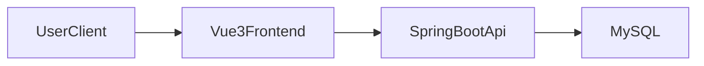
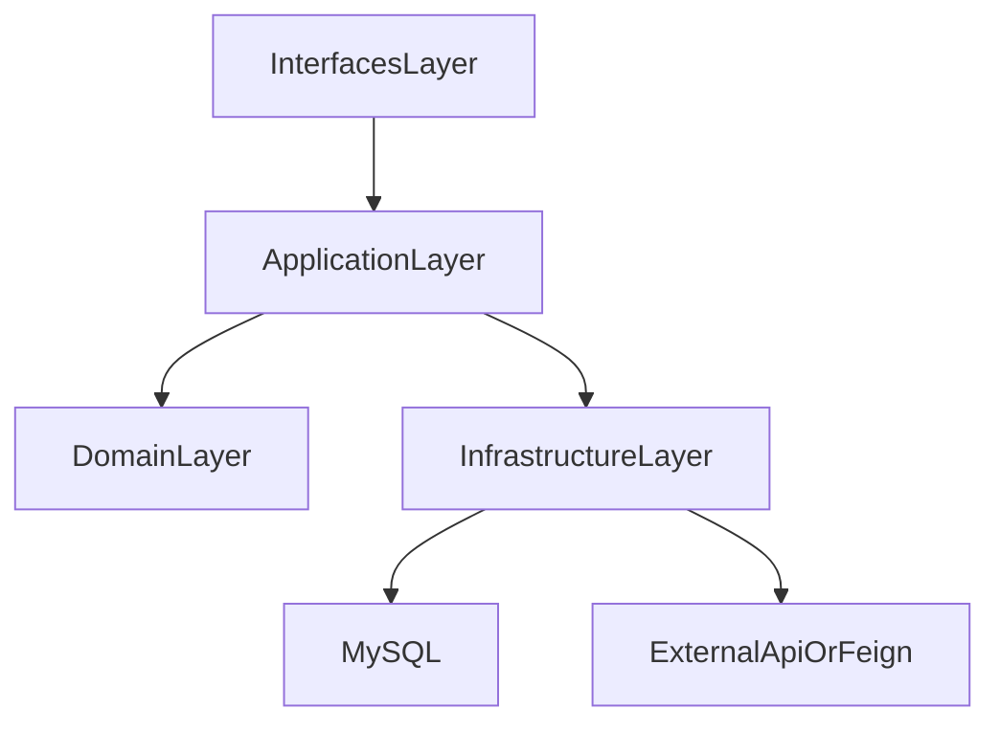

# 架构总览（Architecture Overview）

## 系统总览

## 平台壳层

`platform-shell` 是前端平台壳层能力，不作为 DDD 限界上下文沉淀到 `docs/domain/established/context-map.md`。

- 职责：登录页、全局路由、MainLayout / ModuleLayout、Design Token 与模块入口承载。
- 规格真相：`docs/openspec/specs/platform-shell/spec.md`。
- 模块追溯：`docs/capability-map.md` 中的 `home` / 前端入口相关条目。
- 与领域的关系：壳层消费 `identity-access` 的登录与权限结果，但不拥有业务聚合、不定义领域不变量。

## 后端分层（DDD 可裁剪）

## 分层裁剪原则

- 简单需求：`Controller -> Service -> Mapper`
- 复杂需求：`interfaces -> application -> domain -> infrastructure`
- 每次 change 在 `design.md` 明确裁剪决策与理由
