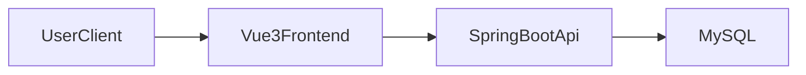
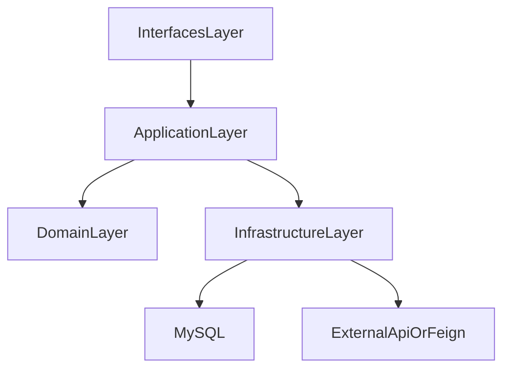

# Architecture Overview

## 系统总览

## 后端分层（DDD 可裁剪）

## 分层裁剪原则

- 简单需求：`Controller -> Service -> Mapper`
- 复杂需求：`interfaces -> application -> domain -> infrastructure`
- 每次 change 在 `design.md` 明确裁剪决策与理由
