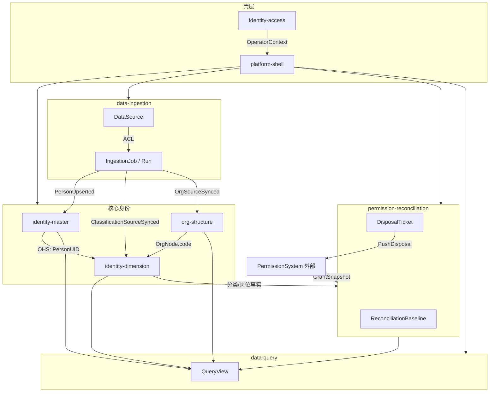

# Context Map（Demo 梳理）

## 1. 限界上下文清单

| 上下文 | 域类型 | 业务职责 | 设计边界 |
| --- | --- | --- | --- |
| **identity-master** 人员基础身份 | 核心域 | 自然人主档、一人一 `PersonUID`、多源合并、冲突裁定、变更审计 | 只回答「这个自然人是谁」；不承载分类树、岗位、授权规则 |
| **identity-dimension** 身份维度 | 核心域 | 分类身份、岗位身份、自定义标签及其挂载 | 通过 `PersonUID` 引用主档；通过 `OrgNode.code` 引用组织 |
| **org-structure** 组织机构 | 支撑域 | 组织树、组织映射、组织花名册读模型 | 组织编码为权威引用；不管理人员身份生命周期 |
| **data-ingestion** 数据接入 | 支撑域 | 采集源注册、字段映射、ETL 任务与运行 | ACL 转换源数据；不拥有最终身份业务事实 |
| **permission-reconciliation** 权限对账治理 | 支撑域 | 权限项、对账基线、快照、差异、处置推送 | **不执行授权发放**；后续可申请审批为扩展 |
| **data-query** 数据查询 | 通用/支撑域 | 预制表、主题查询、受控 SQL、导出 | 只读聚合；不能成为写入口 |
| **identity-access** 平台访问控制 | 通用域 | 操作者账号、RBAC、DataScope、JWT | 与被治理自然人 `PersonUID` 解耦 |
| **platform-shell** 平台壳层 | 通用域 | 首页、模块导航、布局、路由 | 无业务聚合 |

## 2. Context Map



## 3. 集成模式

| 上游 | 下游 | 模式 | 说明 |
| --- | --- | --- | --- |
| data-ingestion | identity-master | ACL + 领域事件 | 源字段/状态转换后发布 `PersonUpserted` |
| identity-master | identity-dimension | OHS（PersonUID） | 下游只持有 ID，不复制主档 |
| org-structure | identity-dimension | 共享内核引用 | 岗位/分类通过 `OrgNode.code` 引用 |
| PermissionSystem（外部） | permission-reconciliation | ACL（GrantSnapshot） | 只读拉取实然授权 |
| permission-reconciliation | PermissionSystem（外部） | 处置推送 | DisposalTicket 推送，非平台直接改权 |
| identity-access | 各 API | 横切 | RBAC + DataScope 过滤 |
| 各核心上下文 | data-query | 发布/订阅（读模型） | 查询为投影视图，最终一致 |

## 4. Demo 信息架构 vs 领域边界

Demo 按「身份四层 + 权限对账 + 系统服务」组织 UI，**不等于**限界上下文一一对应：

```
Demo UI 层                    领域层
─────────────────────────────────────────────
m1 人员基础身份        →  identity-master + data-ingestion
m2 人员分类身份        →  identity-dimension.classification
m3 人员岗位身份        →  identity-dimension.position + org-structure
m4 组织机构体系        →  org-structure
m7 自定义标签          →  identity-dimension.custom-tag
m5 身份权限管理        →  permission-reconciliation
m6/ETL/源头维护        →  data-query + data-ingestion
主页 KPI 看板          →  platform-shell + 跨上下文读模型聚合
```

**关键区分**：m1「源头维护」与 `source-maintenance.html` 属于 **data-ingestion**；m5「权限主数据」属于 **permission-reconciliation**，与外部 **PermissionSystem** 不同。

## 5. 与 established 的差异说明

本分析稿与 `docs/domain/established/context-map.md` **上下文清单一致**，无新增限界上下文。Demo 梳理的价值在于：

- 验证 UI 模块与上下文映射是否合理
- 暴露 Demo 中未写死的跨上下文规则（见 ubiquitous-language 待澄清项）
- 为后续 OpenSpec change（如 `basic-identity`、`classification-identity`）提供页面级追溯
