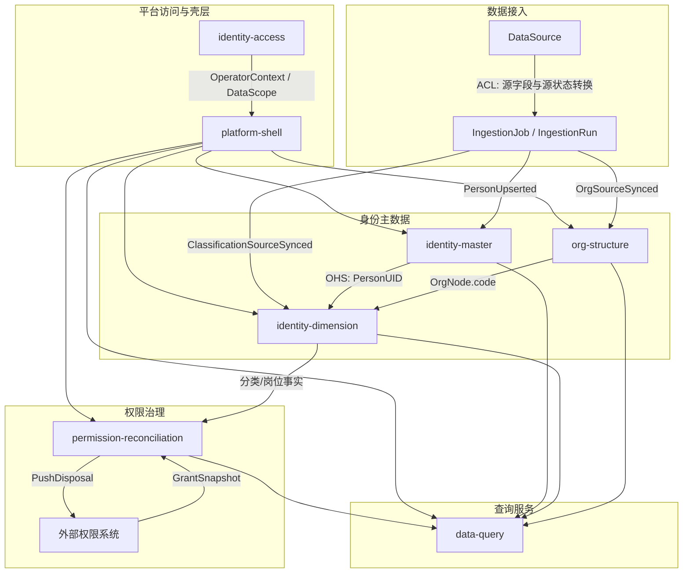

# 高校综合身份数据平台 Demo DDD 领域梳理

> **分篇阅读**（推荐）：见 [README.md](./README.md) · [ubiquitous-language.md](./ubiquitous-language.md) · [context-map.md](./context-map.md) · [domain-model.md](./domain-model.md) · [use-cases.md](./use-cases.md)  
> 本文档为上述分篇的**合并版**，便于一次性通读。

## 0. 建模范围与假设

本分析基于 `docs/原始demo/页面主页.html` 及同目录 Demo 页面，关注业务领域模型，不把页面菜单、数据库表或前端组件直接等同于领域边界。

已确认的关键假设：

- 平台核心业务是“人员身份主数据治理”，围绕自然人、身份维度、组织机构、数据接入、权限对账与查询服务展开。
- “身份权限管理”本期以对账治理、差异识别、处置推送为边界；后续可预留授权申请与审批能力。
- “校友”不是默认并入“在档有效身份人员”的口径，而是可通过其它表或接口接入的人员身份来源/分类；是否纳入活跃统计需要显式业务状态。
- 跨上下文引用应使用稳定标识，例如 `PersonUID`、`OrgNode.code`、`PermissionItem.code`，避免跨聚合直接持有对象。

## 1. 统一语言

| 中文术语 | English | 所属上下文 | 定义 |
| --- | --- | --- | --- |
| 自然人主档 | Person Record | identity-master | 平台对一个自然人的主数据表达，以 `PersonUID` 作为唯一身份标识。 |
| 人员 UID | PersonUID | identity-master | 平台级自然人唯一标识，不等同于平台登录用户 ID、学工号或证件号。 |
| 来源投影 | Source Projection | identity-master | 某个采集源提供的人员字段快照，用于主档合并、冲突识别与审计追溯。 |
| 在档有效身份人员 | Active Identity Person | identity-master | 当前被平台认定仍处于有效身份状态的自然人集合，默认不直接包含校友/纯访客。 |
| 来源人员大类 | Source Person Category | data-ingestion | 接入时按业务来源划分的人员大类，如教职工、学生、外协人员、校友、校外人员。 |
| 采集源 | Data Source | data-ingestion | 向平台供数的业务系统或线下采集渠道，如人事系统、教务系统、研究生系统、校友系统。 |
| 字段映射 | Field Mapping | data-ingestion | 采集源字段到平台标准字段的转换关系。 |
| 采集任务 | Ingestion Job | data-ingestion | 从采集源同步数据的调度单元。 |
| 采集运行 | Ingestion Run | data-ingestion | 某个采集任务的一次执行记录，包含状态、耗时、结果与异常。 |
| 分类节点 | Classification Node | identity-dimension | 校级统一人员分类树中的节点，用于表达人员类型口径。 |
| 人员分类身份 | Person Classification | identity-dimension | 某个 `PersonUID` 挂载到分类节点后的身份事实，可具有状态、有效期、主身份标记。 |
| 映射规则 | Mapping Rule | identity-dimension | 来源系统原始人员类型到校级分类节点的归类规则。 |
| 未映射记录 | Unmapped Record | identity-dimension | 采集到但尚未归入校级标准分类的来源类型或人员记录。 |
| 主身份 | Primary Identity | identity-dimension | 当一个自然人同时具有多种分类身份时，用于展示、统计或默认规则判断的主要身份。 |
| 岗位身份 | Position Identity | identity-dimension | 人员在某组织中的任职关系或职责身份，来源于部门系统或线下采集。 |
| 组织节点 | Org Node | org-structure | 学校组织树中的单位节点，使用稳定组织编码作为引用标识。 |
| 组织映射 | Org Mapping | org-structure | 来源组织编码或名称到校级组织节点的映射关系。 |
| 自定义标签 | Custom Tag | identity-dimension | 数据治理岗基于业务需要对人员做的柔性标注，不替代标准分类或岗位身份。 |
| 权限项 | Permission Item | permission-reconciliation | 可被对账治理的公共权限类型，如进校、校园网、校园卡、图书馆。 |
| 对账基线 | Reconciliation Baseline | permission-reconciliation | 按分类、权限项等维度定义的应然授权规则。 |
| 授权快照 | Grant Snapshot | permission-reconciliation | 从外部权限系统拉取的实然授权状态。 |
| 对账差异 | Reconciliation Diff | permission-reconciliation | 应然规则与实然授权状态不一致的结果，如越权、缺失、僵尸账号。 |
| 处置单 | Disposal Ticket | permission-reconciliation | 将对账差异推送给外部权限系统或责任单位处理的业务单据。 |
| 查询策略 | Query Policy | data-query | 控制预制表查询和即席 SQL 的表范围、行范围、字段范围与审计规则。 |
| 平台操作者 | Interactive User | identity-access | 登录平台执行治理操作的人类账号，不等同于被治理的自然人。 |

## 2. 战略设计：限界上下文

### 2.1 上下文清单

| 限界上下文 | 域类型 | 业务职责 | 设计边界 |
| --- | --- | --- | --- |
| identity-master 人员基础身份 | 核心域 | 建立自然人主档、一人一 `PersonUID`、多源合并、冲突裁定、变更审计。 | 不承载分类树、岗位目录、授权规则；只表达“这个自然人是谁”。 |
| identity-dimension 身份维度 | 核心域 | 管理分类身份、岗位身份、自定义标签及其挂载关系。 | 通过 `PersonUID` 引用人员主档；不复制自然人主档字段。 |
| org-structure 组织机构 | 支撑域 | 维护学校组织树、组织映射、组织花名册读模型。 | 以组织编码为权威引用；不直接管理人员身份生命周期。 |
| data-ingestion 数据接入 | 支撑域 | 管理采集源、字段映射、ETL 任务、运行记录和接入审批。 | 面向外部源系统做防腐转换；不拥有最终人员业务事实。 |
| permission-reconciliation 权限对账治理 | 支撑域 | 维护权限项、对账基线、授权快照、差异识别和处置推送。 | 本期不执行授权发放；后续申请审批可作为扩展能力进入。 |
| data-query 数据查询 | 通用/支撑域 | 提供预制表查询、主题查询、受控 SQL 查询和导出。 | 只读聚合视图，不改变核心领域事实。 |
| identity-access 平台访问控制 | 通用域 | 管理平台操作者账号、角色、权限、数据范围和登录认证。 | 保护平台操作权限；与被治理自然人的 `PersonUID` 解耦。 |
| platform-shell 平台壳层 | 通用域 | 提供首页、模块导航、布局与路由入口。 | 无业务聚合，仅承载用户入口和模块组织。 |

### 2.2 Context Map

上下文关系说明：

- `data-ingestion` 对各源系统采用防腐层，屏蔽源字段、源状态、源分类描述的差异。
- `identity-master` 对下游发布 `PersonUID` 和主档事件，是核心身份事实的上游。
- `identity-dimension` 通过 `PersonUID` 挂载分类、岗位、标签，通过 `OrgNode.code` 引用组织。
- `permission-reconciliation` 消费分类/岗位事实和外部授权快照，输出差异与处置单，但不直接发放权限。
- `data-query` 是只读汇总出口，不能成为领域事实的写入口。

## 3. 战术设计：核心领域模型

### 3.1 identity-master：人员基础身份

**聚合根：PersonRecord**

- 实体：`SourceProjection`、`ChangeLogEntry`
- 值对象：`PersonUID`、`SourceRecordKey`、`IdentityDocument`、`PersonName`、`ContactInfo`
- 领域行为：
  - `upsertFromSource()`：根据采集源投影新建或更新人员主档。
  - `linkSourceProjection()`：将源记录绑定到同一自然人。
  - `markInactive()`：根据来源状态或规则将人员转为非在档。
  - `recordChange()`：写入不可篡改的变更轨迹。
- 领域事件：
  - `PersonRecordCreated`
  - `PersonRecordUpdated`
  - `PersonStatusChanged`
  - `SourceProjectionLinked`

**聚合根：ConflictCase**

- 实体：`ConflictEvidence`、`ResolutionDecision`
- 值对象：`ConflictType`、`ResolutionReason`
- 领域行为：
  - `openConflict()`：发现同名异源、证件冲突、重复人员等问题。
  - `resolve()`：人工裁定归并、拆分或保留差异。
  - `dismiss()`：确认非冲突并关闭。
- 领域事件：
  - `ConflictCaseOpened`
  - `ConflictCaseResolved`

设计意图：自然人主档的强一致性边界是“一个自然人对应一个稳定 `PersonUID`”。分类、岗位、权限都可以变化，但 `PersonUID` 的唯一性和主档审计链不能被下游模块绕过。

### 3.2 identity-dimension：身份维度

**聚合根：ClassificationTree**

- 实体：`ClassificationNode`
- 值对象：`ClassificationCode`、`ClassificationLevel`、`EffectivePeriod`
- 领域行为：
  - `addNode()`：新增校级分类节点。
  - `renameNode()`：修改分类名称或说明。
  - `deprecateNode()`：废弃分类节点并要求迁移策略。
  - `moveNode()`：调整树结构。
- 领域事件：
  - `ClassificationNodeAdded`
  - `ClassificationNodeDeprecated`
  - `ClassificationTreeChanged`

**聚合根：MappingRuleSet**

- 实体：`MappingRule`、`UnmappedRecord`
- 值对象：`SourceTypeKey`、`MappingSuggestion`
- 领域行为：
  - `mapSourceType()`：将来源系统原始人员类型映射到标准分类节点。
  - `remapSourceType()`：调整已有映射。
  - `acceptSuggestion()`：采纳系统建议。
  - `markUnmapped()`：将无法归类的来源记录进入治理队列。
- 领域事件：
  - `MappingRuleCreated`
  - `SourceTypeRemapped`
  - `UnmappedRecordDetected`
  - `UnmappedRecordResolved`

**聚合根：PersonClassification**

- 实体：`ClassificationAssignment`
- 值对象：`PersonUID`、`ClassificationCode`、`ClassificationStatus`、`PrimaryIdentityFlag`
- 领域行为：
  - `attachClassification()`：为人员挂载分类身份。
  - `changeStatus()`：调整在职、在籍、在期、暂停、已结束等状态。
  - `setPrimaryIdentity()`：设置主身份。
  - `expireClassification()`：结束某条分类身份。
- 领域事件：
  - `PersonClassificationAttached`
  - `PrimaryIdentityChanged`
  - `PersonClassificationStatusChanged`

**聚合根：PositionIdentity**

- 实体：`PositionAssignment`、`PositionMappingBatch`
- 值对象：`PositionName`、`AppointmentStatus`、`OrgRef`、`SourcePositionKey`
- 领域行为：
  - `loadSourcePositions()`：加载一个源头的岗位原始数据。
  - `splitMultiValuePosition()`：将多值职务与任职单位拆为一对一明细。
  - `standardizePosition()`：标定岗位映射结果。
  - `attachPosition()`：将岗位身份挂载到 `PersonUID`。
- 领域事件：
  - `PositionSourceLoaded`
  - `PositionMappingStandardized`
  - `PersonPositionAttached`

**聚合根：TagGroup**

- 实体：`CustomTag`、`TagAssignment`
- 值对象：`TagName`、`TagScope`、`PersonUID`
- 领域行为：
  - `createTag()`、`deleteTag()`、`assignTag()`、`removeTag()`
- 领域事件：
  - `TagAssigned`
  - `TagRemoved`

设计意图：分类、岗位、标签都描述“一个人具有什么身份维度”，但不属于同一个强一致性聚合。分类树维护、来源映射和人员挂载的变化频率与不变量不同，应拆成不同聚合，通过事件协作。

### 3.3 org-structure：组织机构

**聚合根：OrgTree**

- 实体：`OrgNode`、`OrgMapping`
- 值对象：`OrgCode`、`OrgType`、`OrgLevel`、`OrgStatus`
- 领域行为：
  - `addOrgNode()`：新增组织节点。
  - `renameOrgNode()`：调整组织名称。
  - `mergeOrgNode()`：合并组织并迁移引用。
  - `mapSourceOrg()`：将来源组织映射到校级组织节点。
- 领域事件：
  - `OrgNodeAdded`
  - `OrgNodeChanged`
  - `OrgNodeMerged`
  - `OrgMappingChanged`

设计意图：组织是岗位、数据范围和统计口径的共同支撑上下文。身份维度只能通过 `OrgNode.code` 引用组织，不能在岗位聚合内维护一套私有组织树。

### 3.4 data-ingestion：数据接入

**聚合根：DataSource**

- 实体：`SourceEndpoint`、`FieldMapping`、`SourceCategoryBinding`
- 值对象：`SourceCode`、`ProtocolType`、`SyncStrategy`、`UniqueKeyDefinition`
- 领域行为：
  - `registerSource()`：注册采集源。
  - `bindCategory()`：将来源人员大类绑定到权威来源系统。
  - `changeFieldMapping()`：维护字段映射。
  - `requestSourceChangeApproval()`：新增或更换来源时发起审批。
- 领域事件：
  - `DataSourceRegistered`
  - `SourceCategoryBound`
  - `FieldMappingChanged`
  - `SourceChangeApprovalRequested`

**聚合根：IngestionJob**

- 实体：`IngestionRun`、`RunStep`
- 值对象：`JobSchedule`、`RunStatus`、`RunSummary`
- 领域行为：
  - `runOnce()`：立即执行任务。
  - `runSequentially()`：按依赖顺序执行任务。
  - `completeRun()`：记录运行结果。
  - `failRun()`：记录失败原因。
- 领域事件：
  - `IngestionRunStarted`
  - `IngestionRunCompleted`
  - `IngestionRunFailed`
  - `SourceClassificationSynced`

设计意图：接入上下文拥有“怎么从源头拿数据、怎么转换源数据”的知识，但不拥有“人员最终是什么身份”的裁定权。入档、分类挂载、组织映射应由对应核心上下文消费接入结果后完成。

### 3.5 permission-reconciliation：权限对账治理

**聚合根：PermissionCatalog**

- 实体：`PermissionItem`
- 值对象：`PermissionCode`、`PermissionStatus`
- 领域行为：
  - `enablePermissionItem()`
  - `disablePermissionItem()`
- 领域事件：
  - `PermissionItemEnabled`
  - `PermissionItemDisabled`

**聚合根：ReconciliationBaseline**

- 实体：`BaselineRule`
- 值对象：`GrantPolicy`、`ClassificationRef`、`PermissionRef`
- 领域行为：
  - `defineRule()`：配置分类与权限项之间的应然关系。
  - `changePolicy()`：在默认授予、可申请、不予授权之间调整。
- 领域事件：
  - `BaselineRuleChanged`

**聚合根：ReconciliationRun**

- 实体：`GrantSnapshot`、`ReconciliationDiff`
- 值对象：`DiffType`、`DiffSeverity`
- 领域行为：
  - `importGrantSnapshot()`：导入外部权限系统实然授权状态。
  - `compareWithBaseline()`：计算越权、缺失、僵尸账号、规则缺失等差异。
  - `markDiffIgnored()`：基于治理规则忽略差异。
- 领域事件：
  - `ReconciliationRunCompleted`
  - `ReconciliationDiffDetected`

**聚合根：DisposalTicket**

- 实体：`DisposalAction`、`PushAttempt`
- 值对象：`TicketStatus`、`ExternalSystemRef`
- 领域行为：
  - `createFromDiff()`：由对账差异生成处置单。
  - `pushToPermissionSystem()`：推送外部权限系统处理。
  - `acknowledge()`：记录外部系统确认。
- 领域事件：
  - `DisposalTicketCreated`
  - `DisposalTicketPushed`
  - `DisposalTicketAcknowledged`

设计意图：Demo 中的“身份权限管理”更接近治理对账，而非授权系统。强一致性边界是一次对账运行内的快照、基线和差异结果；授权发放由外部权限系统负责。

### 3.6 data-query：数据查询

**聚合根：QueryPolicy**

- 实体：`QueryViewDefinition`、`SqlWhitelistRule`、`QueryAuditRecord`
- 值对象：`TableRef`、`FieldRef`、`DataScopeRef`
- 领域行为：
  - `allowPresetQuery()`：授权预制表查询。
  - `validateAdHocSql()`：校验即席 SQL 只能访问允许表和字段。
  - `recordQueryAudit()`：记录查询审计。
- 领域事件：
  - `QueryExecuted`
  - `AdHocSqlRejected`

设计意图：数据查询是只读服务，服务治理岗检索和导出，不应绕过核心上下文直接改写领域事实。

## 4. 核心用例校验

### 4.1 用例一：源头采集入档并处理分类映射

1. 命令：数据治理岗触发“同步源头数据”或 ETL 调度触发 `RunIngestionJob`。
2. 应用服务：`IngestionAppService` 加载 `DataSource`、字段映射和任务依赖，创建 `IngestionRun`。
3. 接入聚合：`IngestionJob.runOnce()` 拉取源记录，完成字段转换，发布 `IngestionRunCompleted` / `SourceClassificationSynced`。
4. 人员主档：`PersonRecord.upsertFromSource()` 根据源投影创建或更新自然人主档，必要时打开 `ConflictCase`。
5. 身份维度：`MappingRuleSet.mapSourceType()` 将来源类型归入标准分类；无法归类时产生 `UnmappedRecordDetected`。
6. 人员分类：`PersonClassification.attachClassification()` 将分类身份挂载到 `PersonUID`，并可能触发 `PersonClassificationAttached`。
7. 下游影响：权限对账可在下次运行中读取新的分类事实，查询视图刷新统计口径。

模型校验点：

- 数据接入只负责采集和转换，不直接决定最终分类身份。
- 未映射是治理任务，不是脏数据静默丢弃。
- 分类树、映射规则、人员分类挂载分属不同聚合，避免一个大聚合承载所有变化。

### 4.2 用例二：权限基线对账并推送处置

1. 命令：治理岗启动检查任务 `StartReconciliationRun`。
2. 应用服务：`PermissionReconciliationAppService` 读取有效 `ReconciliationBaseline`、分类身份事实和外部 `GrantSnapshot`。
3. 对账聚合：`ReconciliationRun.compareWithBaseline()` 计算越权、缺失授权、僵尸账号、规则缺失等差异。
4. 处置聚合：对需要外部处理的差异执行 `DisposalTicket.createFromDiff()`。
5. 集成服务：`DisposalTicket.pushToPermissionSystem()` 将处置建议推送外部权限系统。
6. 领域事件：发布 `ReconciliationDiffDetected`、`DisposalTicketPushed`，用于首页统计、数据查询和后续审计。

模型校验点：

- 平台判断“应然”和“差异”，外部权限系统执行授权或撤权。
- “可申请”是规则状态，不等于平台已具备审批能力；后续若建设审批，应单独建模申请、审批、发放闭环。
- 僵尸账号依赖人员状态事实，不能只从授权快照单表推断。

## 5. 关键不变量

- 一个自然人主档只能有一个稳定 `PersonUID`；平台登录账号 ID 与 `PersonUID` 必须解耦。
- 来源人员大类绑定权威来源系统需要审批；平台不直接修改源头人员明细。
- 一个来源系统下的同一原始人员类型只能映射到一个标准分类节点。
- 已绑定映射或存在人员挂载的分类节点不能直接删除，只能废弃并迁移。
- 岗位身份数据来自源头部门或线下采集，平台侧以治理标定和只读展示为主。
- 跨聚合引用只保存 ID，不保存其它聚合对象。
- 权限对账不等同于授权发放；对账结果通过处置单交由外部权限系统或责任单位处理。
- 查询服务只能读领域事实和投影视图，不能成为业务写入口。

## 6. 待产品确认问题

1. 校友数据接入后，哪些状态算“活跃校友”？是否参与全校“在档人数”和权限对账？
2. 学生大类同时涉及教务系统与研究生系统时，是一个大类双源合并，还是拆分为本科生/研究生两个权威来源子类？
3. 分类状态“暂停/已结束”和“是否有效授权状态”之间是否存在自动联动规则？
4. 未映射记录被处理后，是否立即触发权限重算/对账，还是等待下一次 ETL 与对账任务？
5. 组织树由平台维护还是外部组织系统权威下发？平台新增、合并、撤销组织是否需要审批发布？
6. 后续“可申请授权”若落地审批，审批主体是平台内完成，还是仍由外部权限系统完成？

