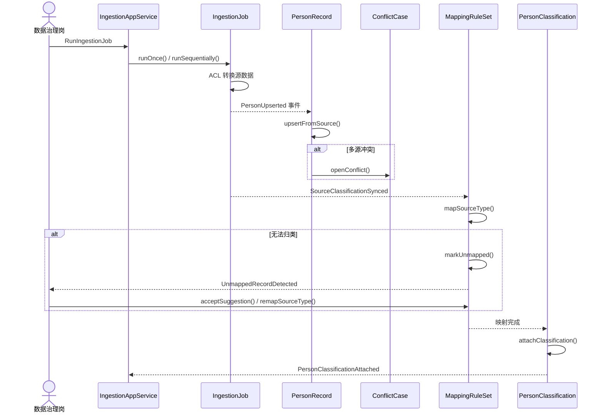
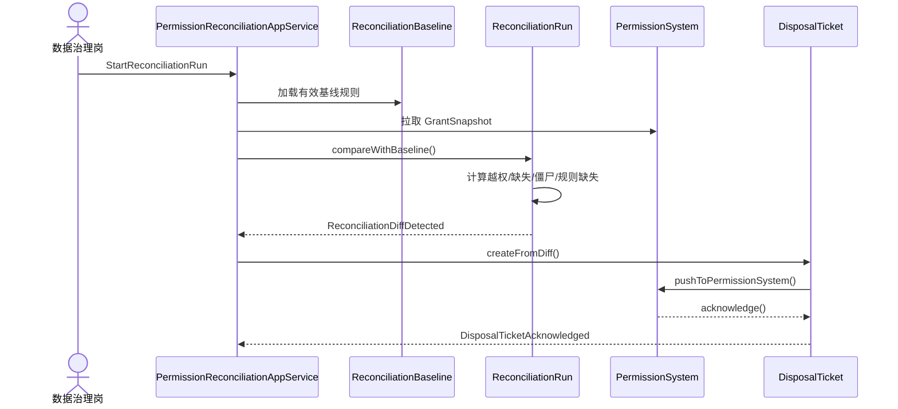

# 核心用例校验（Demo 梳理）

> 选取 Demo 中 2 条核心交互链路，验证「命令 → 应用服务 → 聚合根 → 领域事件」流转是否合理。

## 用例一：源头采集入档并处理分类映射

**Demo 触发点**：`etl-monitor.html` 顺序执行 / `source-maintenance.html` 配置完成后同步 · `m2` 未映射人员处理

| 步骤 | 说明 |
| --- | --- |
| 1. 命令 | `RunIngestionJob`（手动或 cron） |
| 2. 应用服务 | 加载 DataSource、字段映射、任务依赖，创建 IngestionRun |
| 3. 接入聚合 | 拉取源记录、字段转换，发布 `IngestionRunCompleted` |
| 4. 人员主档 | `PersonRecord.upsertFromSource()`；冲突时 `ConflictCase.openConflict()` |
| 5. 映射规则 | `MappingRuleSet.mapSourceType()`；失败 → `UnmappedRecordDetected` |
| 6. 人员分类 | `PersonClassification.attachClassification()` |
| 7. 下游 | 权限对账下次运行读取新分类；查询视图刷新 KPI |

**模型校验通过点**：

- ✅ 接入只负责采集/转换，不直接裁定最终分类身份
- ✅ 未映射是治理队列，非静默丢弃
- ✅ 分类树、映射规则、人员挂载为独立聚合

**Demo 暴露的缺口**：未映射处理后是否立即触发对账/E TL 重跑——时序待产品确认。

---

## 用例二：权限基线对账并推送处置

**Demo 触发点**：`m5-identity-permission.html` 检查任务执行 · 对账异常推送

| 步骤 | 说明 |
| --- | --- |
| 1. 命令 | `StartReconciliationRun` |
| 2. 应用服务 | 读取 ReconciliationBaseline + 分类身份事实 + GrantSnapshot |
| 3. 对账聚合 | `compareWithBaseline()` → 越权、缺失、僵尸账号、规则缺失 |
| 4. 处置聚合 | `DisposalTicket.createFromDiff()` |
| 5. 集成 | `pushToPermissionSystem()` → 外部执行授权/撤权 |
| 6. 事件 | `ReconciliationDiffDetected` · `DisposalTicketPushed` → 主页 KPI / 审计 |

**模型校验通过点**：

- ✅ 平台管应然与差异，外部 PermissionSystem 管实然变更
- ✅ 「可申请」是基线规则状态，≠ 平台已有审批能力
- ✅ 僵尸账号需结合人员状态事实（identity-master / identity-dimension），不能仅从快照推断

**Demo 暴露的缺口**：主页「已授权占比」统计来源是快照还是基线推导——需在对账 spec 中写死。

---

## 用例覆盖与后续 change 映射

| 用例 | 主要上下文 | 建议 OpenSpec change |
| --- | --- | --- |
| 源头采集入档 | data-ingestion + identity-master | `data-ingestion` · `basic-identity` |
| 分类映射治理 | identity-dimension | `classification-identity` |
| 权限基线对账 | permission-reconciliation | `identity-permission` |
| 数据查询出口 | data-query | `data-query-service` |
