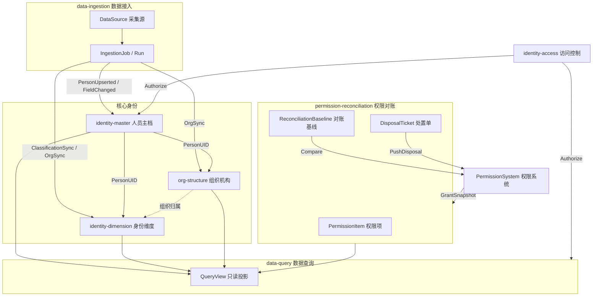

# Context Map (Developing)

> **Change:** `identity-platform-domain`  
> **Status:** developing（归档前仅本 change 使用）  
> **Last updated:** 2026-06-20

## 说明

高校综合身份数据平台的限界上下文地图。本 change **只产出模型与决策**，不落地业务表/API。

## 上下文清单

| Context | 中文名 | 职责摘要 | 对应 demo 模块 |
| --- | --- | --- | --- |
| `identity-master` | 人员基础身份 | 自然人主档、PersonUID、多源采集投影、变更审计 | m1 |
| `identity-dimension` | 身份维度 | 分类 / 岗位 / 自定义标签，挂载于主档 | m2, m3, m7 |
| `org-structure` | 组织机构 | 组织树、组织↔源头映射、组织维度人员清单 | m4 |
| `data-ingestion` | 数据接入 | 采集源注册、字段映射、ETL 任务与运行记录 | source-maintenance, etl-monitor, m1 同步视图 |
| `permission-reconciliation` | 权限对账治理 | 权限项主数据、对账基线、差异、处置推送（**不授权**） | m5 |
| `data-query` | 数据查询 | 预置表/SQL 只读查询、审计与 ACL（规则在此定调） | m6 |
| `identity-access` | 访问控制 | 平台登录/RBAC（Mock → 真实鉴权，可独立 change） | 登录页 |
| `platform-shell` | 平台壳层 | 顶栏 + 模块布局 + 路由（established，004 已纠偏为 ModuleLayout） | 主页 |

### 子域划分（identity-dimension 内部）

| 子域 | 聚合 | 备注 |
| --- | --- | --- |
| classification | ClassificationTree, PersonClassification, MappingRule, UnmappedQueue | m2 主站 + admin 合并为同一上下文内「治理/运营」视图 |
| position | PositionCatalog, PositionMapping, PersonPosition | 映射治理写、列表读 |
| custom-tag | TagGroup, TagAssignment | 基于主档 UID 标注，岗位为可选约束 |

## 关系图

## 集成模式

| 上游 | 下游 | 模式 | 说明 |
| --- | --- | --- | --- |
| data-ingestion | identity-master | ACL + 领域事件 | 采集结果以 Upsert 写入主档，附 `sourceSystemId` + `sourceRecordKey` |
| data-ingestion | identity-dimension / org-structure | ACL | 分类树/组织树增量同步，非 UI 手工改主数据 |
| identity-master | identity-dimension | OHS（开放主机服务） | 维度模块只通过 PersonUID 引用自然人 |
| permission-reconciliation | 外部 PermissionSystem | 防腐层 + 推送 | 平台不持有授权写接口，只读快照 + 出站处置 |
| identity-master 等 | data-query | 只读副本 / CQRS 投影 | m6 读模型；与 m5 对账快照职责分离（见 Q-M6-03） |
| identity-access | 各上下文 API | 横切 | RBAC 与行级范围在 API 层 enforcement |

## 与 Established 的关系

- `platform-shell`：004 已改为 **顶栏 + ModuleLayout**，established 中「侧栏指标平台」描述将在本 change 归档时由 sync-knowledge 更新。
- `identity-access-mock`：保留至真实 `identity-access` change；与本平台业务上下文通过 API 边界隔离。

## 🔴 阻断项处置（context 视角）

| 编号 | 处置 | 结论 |
| --- | --- | --- |
| QG-01 | **解决** | 拆为 `DataSource`（data-ingestion）与 `PermissionSystem`（permission-reconciliation 外部系统） |
| QG-04 | **解决** | 平台统一 `PersonUID`；源系统键独立为 `SourceRecordKey` |
| QG-08 | **解决** | 三套 UI 收敛到 `data-ingestion` 单一上下文：注册→任务→运行→事件入库 |
| Q-M1-02 | **解决** | 主档 UI 只读；冲突在「裁定工作台」（identity-master 子能力）处理，非自由编辑 |
| Q-M1-03 | **解决** | 单一 `ChangeLog` 聚合，来源于采集事件 + 裁定结论 |
| Q-M2-01 | **解决** | 前端 004 子路由已覆盖；领域上 m2 主站/admin 为同一上下文不同应用服务 |
| Q-M2-02 | **解决** | `UnmappedQueue` 为显式聚合，闭环：发现→映射规则→归类→消队列 |
| Q-M3-01 | **解决** | 岗位列表只读；`PositionMapping` 治理写操作独立用例 |
| Q-M3-02 | **解决** | 禁止用 `/` 拆单位名；源头提供结构化 `orgUnitCode` |
| Q-M4-01 | **解决** | 组织 code 以 `SYSU_ORG` 编码为唯一权威；映射/花名册禁止 demo 假 code |
| Q-M5-01 | **解决** | UI 改名「对账基线矩阵」；明确只读基线 + 不含授权动作 |
| Q-M5-02 | **解决** | 引入 `DisposalTicket` 聚合建模推送闭环（MVP 可 stub 外部回执） |
| Q-M6-01 | **解决** | data-query 上下文定义 QueryPolicy（表 ACL + 审计）；实现在 `data-query-service` change |
| Q-SRC-01 | **推迟** | 页面重写属 ui 实现，不阻塞领域模型 |
