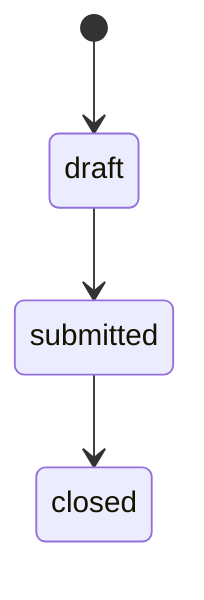

# Data Dictionary (Developing)

## 说明

本文件记录开发中（可能回滚）的数据库**业务语义**，归档后提升到 established。

- 结构真相在 Flyway 迁移脚本（`backend/xj-zbpt-business/src/main/resources/db/migration/`），不在此复制
- 实时结构由 MySQL MCP（只读）读取
- 本文件只记录 DDL 里看不出的「代码外知识」：字段业务含义、状态流转、约束理由

## 表清单

当前暂无开发中条目。

## 模板

### <表名> <table_name>

- 限界上下文：`<context>`
- 业务含义：<这张表代表什么业务概念>

| 字段 | 类型 | 业务含义 | 约束/理由 |
| --- | --- | --- | --- |
| `<col>` | `<type>` | <含义> | <为什么有这约束> |

**状态流转**（如有状态字段）：

**关键规则**：
- <如：截止时间后 status 不可回退>
