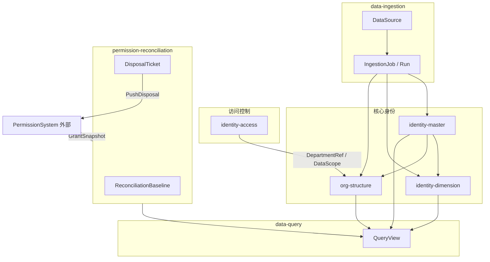

# 上下文映射（Context Map，已归档）

## 说明

本文件记录已归档、可稳定复用的限界上下文关系。

## 上下文清单

### identity-access（平台访问控制）

- status: active
- 来源：change `platform-user-access-control`（2026-06-21）
- 业务含义：InteractiveUser 账号、RBAC、DataScope、OperatorContext；与 PersonUID 无关
- 对应 spec：`docs/openspec/specs/identity-access/spec.md`

### identity-master（人员基础身份）

- status: active
- 来源：change `identity-platform-domain`（2026-06-20）
- 业务含义：自然人主档、PersonUID、多源投影、冲突裁定、ChangeLog
- 对应 spec：`docs/openspec/specs/identity-master/spec.md`

### identity-dimension（身份维度）

- status: active
- 来源：change `identity-platform-domain`（2026-06-20）
- 业务含义：分类 / 岗位 / 自定义标签，挂载于 PersonUID
- 对应 spec：`docs/openspec/specs/identity-dimension/spec.md`

### org-structure（组织机构）

- status: active
- 来源：change `identity-platform-domain`（2026-06-20）；最小 `org_node` 种子由 `platform-user-access-control`（2026-06-21）落地
- 对应 spec：`docs/openspec/specs/org-structure/spec.md`

### data-ingestion（数据接入）

- status: active
- 来源：change `identity-platform-domain`（2026-06-20）
- 业务含义：DataSource 注册、IngestionJob/Run、注册→采集→入库
- 对应 spec：`docs/openspec/specs/data-ingestion/spec.md`

### permission-reconciliation（权限对账治理）

- status: active
- 来源：change `identity-platform-domain`（2026-06-20）
- 业务含义：对账基线、差异、DisposalTicket；**不执行授权**
- 对应 spec：`docs/openspec/specs/permission-reconciliation/spec.md`

### data-query（数据查询）

- status: active
- 来源：change `identity-platform-domain`（2026-06-20）
- 业务含义：QueryPolicy、AdHocSQL 安全边界
- 对应 spec：`docs/openspec/specs/data-query/spec.md`

## 关系图

## 集成模式（摘要）

| 上游 | 下游 | 模式 |
| --- | --- | --- |
| data-ingestion | identity-master | 防腐层 + 领域事件 |
| identity-master | identity-dimension | OHS（PersonUID） |
| permission-reconciliation | PermissionSystem | 防腐层 + 处置推送 |
| identity-access | 受保护业务能力 | 横切 RBAC + DataScope |

完整关系与阻断项处置见归档 change `identity-platform-domain` 与 ADR 0007。
