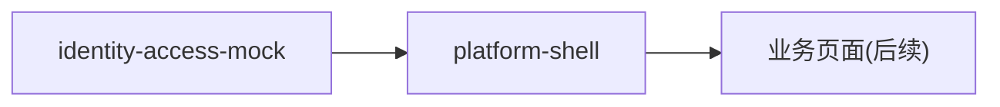

# Context Map (Established)

## 说明

本文件仅记录已归档、可稳定复用的限界上下文关系。

## 上下文清单

### platform-shell（平台壳层）

- status: active
- 来源：change `frontend-app-shell`（已归档 2026-06-18）
- 业务含义：登录页、全局路由、主布局（侧栏 + 内容区）与设计系统；不含具体业务
- 对应 spec：`openspec/specs/platform-shell/spec.md`
- 下游：各业务页面在主布局内容区插槽中渲染

### identity-access-mock（Mock 身份与访问）

- status: active
- 来源：change `frontend-app-shell`（已归档 2026-06-18）
- 业务含义：前端阶段的本地 Mock 登录、路由守卫、会话持久化抽象；为后续真实鉴权预留
- 对应 spec：`openspec/specs/identity-access-mock/spec.md`
- 后续：将被真实 `identity-access`（后端鉴权）替代

## 关系图

