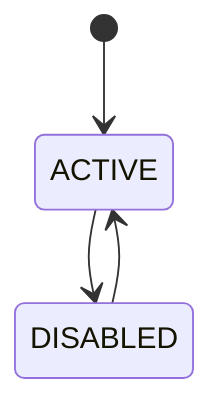
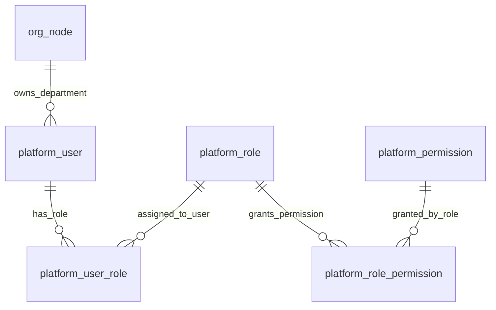

# 数据字典（Data Dictionary，已归档）

## 说明

本文件记录已归档、可作为事实引用的数据库**业务语义**。

- 结构真相在 Flyway 迁移脚本，不在此复制
- 实时结构由 MySQL MCP（只读）读取
- 本文件只记录 DDL 里看不出的「代码外知识」：字段业务含义、状态流转、约束理由
- 写入规则：🔴 经 `sync-knowledge` 从 developing 提升；🟢/🟡 完成后人确认直接写入

## 表清单

### org_node

- 限界上下文：`org-structure`（最小种子，006 落地）
- 业务含义：权威组织树节点；code 来自 SYSU_ORG；供 identity-access 的 DepartmentRef 与 DataScope 树遍历

| 字段 | 业务含义 | 约束/理由 |
| --- | --- | --- |
| code | 组织节点唯一编码 | 与 SYSU_ORG mock 一致，DepartmentRef 外键式引用 |
| parent_code | 上级组织 code | 用于 OWN_DEPT_AND_SUB 子孙派生 |
| level | 层级深度 | 辅助展示，非权限判定主依据 |

### platform_user

- 限界上下文：`identity-access`
- 业务含义：平台操作者（InteractiveUser）持久化；与 PersonUID 无关

| 字段 | 业务含义 | 约束/理由 |
| --- | --- | --- |
| platform_user_id | 平台用户业务 ID | 对外稳定引用，避免暴露自增主键 |
| username | 登录名 | 全局唯一 |
| password_hash | 凭证哈希 | 禁止明文；具体哈希算法属于安全实现决策，见 ADR 0008 |
| department_code | DepartmentRef | MUST 存在于 org_node |
| data_scope | 数据范围档位 | GLOBAL / OWN_DEPT / OWN_DEPT_AND_SUB |
| status | 账号状态 | DISABLED 禁止登录 |

**状态流转：**

### platform_role

- 限界上下文：`identity-access`
- 业务含义：平台角色；用于把一组权限授予平台操作者

| 字段 | 业务含义 | 约束/理由 |
| --- | --- | --- |
| role_code | 角色编码 | 全局唯一；种子角色包括 ADMIN、GOVERNANCE |
| name | 角色展示名 | 面向运营/管理界面展示 |
| description | 角色说明 | 说明角色边界，避免仅凭编码理解授权含义 |

### platform_permission

- 限界上下文：`identity-access`
- 业务含义：平台功能权限点；连接前端模块、后端能力与 RBAC 授权

| 字段 | 业务含义 | 约束/理由 |
| --- | --- | --- |
| permission_code | 权限编码 | 全局唯一；采用 `module:action` 形式，如 `identity-basic:read` |
| module_name | 模块编码 | 与前端 `moduleKey` 对齐，用于模块级访问控制 |
| action_name | 操作编码 | 表示 read / write 等动作，避免把动作语义塞进展示名 |

**关键规则：**

- `module_name` 必须与前端能力追溯索引中的 `moduleKey` 保持一致。
- 当前种子权限以 `read` 为主，用户管理写权限使用 `users-write` 等更细动作名。

### platform_user_role

- 限界上下文：`identity-access`
- 业务含义：平台用户与角色的授权关系；一个用户可拥有多个角色

| 字段 | 业务含义 | 约束/理由 |
| --- | --- | --- |
| user_id | 平台用户主键引用 | 与 `platform_user.id` 组成联合主键，防止重复授权 |
| role_id | 平台角色主键引用 | 与 `platform_role.id` 组成联合主键，表达用户-角色多对多 |

### platform_role_permission

- 限界上下文：`identity-access`
- 业务含义：角色与权限点的授权关系；一个角色可包含多个权限点

| 字段 | 业务含义 | 约束/理由 |
| --- | --- | --- |
| role_id | 平台角色主键引用 | 与 `platform_role.id` 组成联合主键，防止重复授权 |
| permission_id | 平台权限主键引用 | 与 `platform_permission.id` 组成联合主键，表达角色-权限多对多 |

### identity-access 关系图

> 只表达表间业务关系；字段清单与类型以 Flyway 迁移脚本为准。

