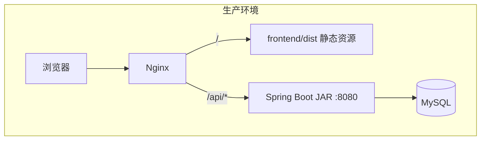
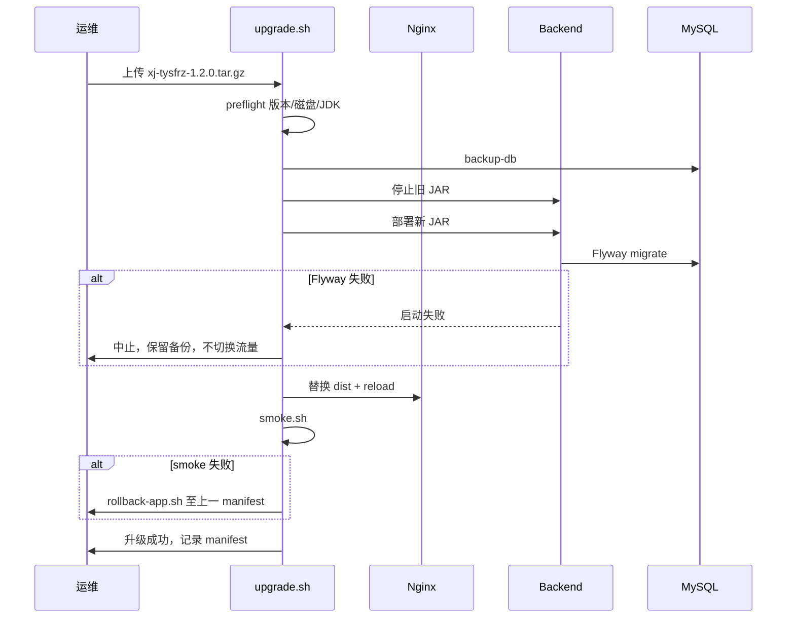
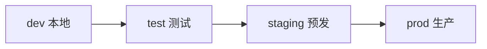
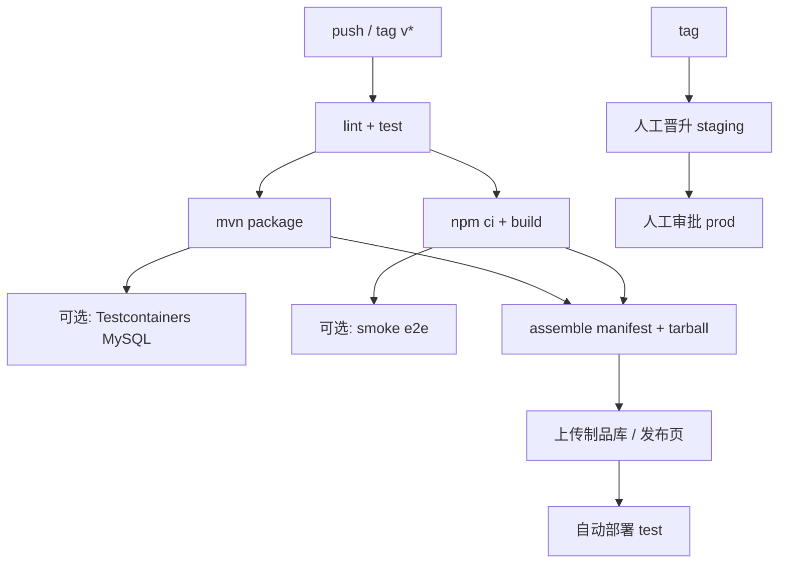

# 升级发布能力设计

> 状态：草案（§13 已确认，待实现 003）  
> 档位：🟡 技术 change（首阶段）→ 后续可拆 🔴 若含运维审批流/多环境编排  
> 范围：**平台工程能力**，不含 demo 业务模块（m1~m7）  
> 关联：`temp/04-work-backlog.md`、ADR 0003/0004

---

## 1. 要解决什么问题

当前仓库是 **Vue 前端 + Spring Boot 后端 + MySQL** 单体仓库，已有 Flyway、OpenAPI、前后端分离 dev 联调，但缺少：

| 缺口 | 后果 |
| --- | --- |
| 无统一版本号与发布物 | 现场不知道跑的是哪一版，排障困难 |
| 前后端独立迭代无契约 | 前端发新版可能调旧 API，或后端迁移后前端未更新 |
| 无标准部署包与升级步骤 | 高校内网/on-prem 交付靠手工拷贝 jar/dist |
| Flyway 与回滚无流程 | 升级失败不知回退应用还是数据库 |
| 无「维护窗口 / 兼容性」机制 | 发版时用户仍操作可能脏写 |

**目标：** 建立可重复的 **版本标识 → 构建产物 → 环境发布 → 升级/回滚 → 运行态可观测** 闭环；首版偏 **脚本 + 版本 API + 管理端只读展示**，不做重型发布中心。

---

## 2. 设计原则

1. **发布单元 = 平台发行版（Release）**，不是单个 demo 页面；**FE 与 BE 强制同一 Git tag**（如 `v1.2.0`），manifest 中组件版本与发行版一致，不做独立 patch tag。
2. **数据库迁移是升级硬门槛**：Flyway 失败则后端不进入 `READY`（Spring Boot 默认行为），发布脚本以此作为闸门。
3. **默认同源部署**：生产 Nginx 托管前端静态 + 反代 `/api` 到后端，避免生产 CORS；dev 继续用 CORS（ADR 0004）。
4. **SemVer + 兼容性矩阵**：主版本不兼容；次版本可加 API/表；补丁可 FE-only 或 BE-only。
5. **先自动化打包与校验，后做 UI 编排**；避免第一版就做「页面上传安装包」。

---

## 3. 版本模型

### 3.1 三层版本（不要混为一谈）

| 层级 | 标识 | 来源 | 用途 |
| --- | --- | --- | --- |
| **平台发行版** | `1.2.0` | Git tag `v1.2.0` | 对外交付、changelog、运维手册 |
| **组件构建版** | `backend@1.2.0` / `frontend@1.2.0` | pom.xml / package.json，与发行版同步 bump | 与发行版同 tag；hotfix 仍打新 tag（如 `v1.2.1`）全量重发 |
| **Schema 版** | `V3` | Flyway 最新脚本 `V3__*.sql` | 升级前检查、回滚决策（DB 通常只前滚） |

### 3.2 兼容性规则（写入 manifest）

```json
{
  "release": "1.2.0",
  "components": {
    "backend": { "version": "1.2.0", "minJvm": "21" },
    "frontend": { "version": "1.2.0" }
  },
  "compatibility": {
    "frontendRequiresBackend": ">=1.2.0 <1.3.0",
    "backendRequiresFrontend": ">=1.2.0 <1.3.0"
  },
  "database": {
    "flywayTarget": "3",
    "breaking": false
  }
}
```

- **breaking: true**（删列、改类型、不可逆）：必须维护窗口 + 全量备份 + 禁止 FE/BE 单独回滚 DB。
- **breaking: false**：可先滚应用；DB 保持已执行迁移（Flyway 不回滚，靠向前兼容迁移）。

### 3.3 运行态版本 API（联调与运维共用）

新增技术接口（非 demo 业务）：

```
GET /api/system/info
```

```json
{
  "code": 0,
  "data": {
    "platformName": "高校综合身份数据平台",
    "release": "1.2.0",
    "backendVersion": "1.2.0",
    "buildTime": "2026-06-19T08:00:00Z",
    "gitCommit": "abc1234",
    "flywayVersion": "3",
    "apiPrefix": "/api",
    "maintenance": false
  }
}
```

前端构建时注入 `VITE_APP_VERSION` / `VITE_BUILD_TIME`，登录后页脚或「关于」展示；启动时可选调用 `/api/system/info` 校验 **前后端是否匹配**（不匹配显示横幅，不阻断登录）。

---

## 4. 部署拓扑（推荐默认）



| 模式 | 适用 | 说明 |
| --- | --- | --- |
| **A. Nginx + JAR**（推荐首版） | 高校内网单机/双机 | 简单、与现有技术栈一致 |
| **B. Docker Compose** | 需环境一致性 | `nginx` + `backend` + `mysql` 三容器 |
| **C. K8s** | 大规模/多实例 | 二期；需健康检查、滚动发布、配置中心 |

**前端迭代：** 替换 `dist/` 并 reload Nginx，**无需**重启后端（纯 UI/API 路径未变）。  
**后端迭代：** 替换 JAR → 停服 → Flyway 迁移 → 启动 → `/actuator/health` UP。  
**全量发行版：** 使用统一发布包（见 §5），脚本按顺序执行。

---

## 5. 发布物结构

```
xj-tysfrz-1.2.0/
├── manifest.json          # 版本、兼容性、SHA256
├── CHANGELOG.md
├── backend/
│   └── xj-tysfrz-backend-1.2.0.jar
├── frontend/
│   └── dist/              # vite build 产物
├── config/
│   ├── nginx.conf.example
│   └── application-prod.yml.example  # 无密钥，仅占位说明
└── scripts/
    ├── preflight.sh       # JDK、磁盘、MySQL、当前版本检查
    ├── backup-db.sh       # 升级前 mysqldump
    ├── upgrade.sh         # 停服 → 备份 → 替换 → 启动 → smoke
    ├── rollback-app.sh    # 仅回滚 jar + dist，不碰 DB
    └── smoke.sh           # health + /api/ping + /api/system/info
```

构建入口（CI 或本地）：

```bash
# 伪命令，实现期落 scripts/release/build.sh
./scripts/release/build.sh 1.2.0
```

---

## 6. 升级发布流程



### 6.1 维护窗口（Maintenance Window）

**含义：** 发版升级前划定的短时间服务不可用或只读时段（例如 22:00–22:30）。  
目的是在停服换包、Flyway 迁移、回滚探测期间，避免用户继续写入产生脏数据或与新旧版本混跑。

**首版实现（已确认）：** Nginx 返回静态 `503.html`（或 `return 503` + 自定义页），升级脚本在换包前切换 upstream/location，完成后恢复。不实现 `POST /api/system/maintenance` 管理接口。

**二期可选：** 后端 maintenance 开关 + 管理端提示文案，用于需要「只读而非全停」的场景。

### 6.2 发版组合策略（同 tag 约束下）

| 场景 | 做法 |
| --- | --- |
| 仅 FE bugfix | 仍打新 tag（如 `v1.2.1`），manifest 中 FE+BE 版本同步；若 BE 无变更则复用上一 JAR 或同版本号重打 |
| 仅 BE bugfix | 同上，全 tag 发布；FE 无代码变更时可复用上一 dist |
| BE 新增 API + FE 使用 | **同一 tag 一次发** |
| BE breaking + DB | 维护窗口；**禁止**仅回滚应用而 DB 已迁移 |

---

## 7. 环境与晋升



| 环境 | 前端 | 后端 | 数据库 | 发布频率 |
| --- | --- | --- | --- | --- |
| dev | vite dev | spring-boot:run | 本地 MySQL | 随时 |
| test | dist + nginx | JAR | 独立库 | 每 PR / nightly |
| staging | 发布包 | 发布包 | 生产镜像 | 发行候选 RC |
| prod | 发布包 | 发布包 | 生产库 | 按变更窗口 |

**配置分离：** 密钥与连接串仅环境变量 / 外部 `application-prod.yml`，不进 Git（延续 ADR 0003）。

---

## 8. CI/CD 流水线（建议）



**Tag 规则：** `v1.2.0` 触发发行构建；`main` 上 commit 只构建 snapshot 不发生产包。

---

## 9. 产品内「升级发布」功能边界（避免过度设计）

### 首版（MVP）— 建议 change: `release-version-foundation` 🟡

| 能力 | 交付 |
| --- | --- |
| 版本 API | `GET /api/system/info` |
| 构建注入 | FE `VITE_*`、BE `build-info.properties`（git commit、time） |
| 前端展示 | 页脚/AppFooter 显示 `v1.2.0`；可选版本不匹配横幅 |
| 打包脚本 | `scripts/release/build.sh` + manifest |
| 文档 | `docs/operations/upgrade-guide.md` |

### 二期 — `release-upgrade-automation` 🟡

| 能力 | 交付 |
| --- | --- |
| 运维脚本 | preflight / backup / upgrade / rollback-app / smoke |
| Docker Compose | 一键演示环境 |
| CI | GitHub Actions / 自建 Jenkins 模板 |

### 三期（按需）— 🔴 若要做「平台内升级」

| 能力 | 交付 |
| --- | --- |
| 管理端「版本与升级」页 | 只读：当前/可升级版本、changelog |
| 维护模式开关 | 需 identity-access 鉴权 |
| 制品上传 + 远程触发升级 | 安全与审计要求高，单独 Approval Gate |

**不建议** 第一版就做 Web 界面上传 JAR 并自动重启——高校场景通常由运维 SSH + 脚本执行，Web 化留三期。

---

## 10. 与现有代码的关系

| 已有 | 升级发布中的角色 |
| --- | --- |
| Flyway `V*__*.sql` | Schema 升级唯一真相源 |
| `/actuator/health` | smoke 闸门 |
| `/api/ping` | 联调 + 发布后存活探测 |
| OpenAPI `/v3/api-docs` | 契约 diff，breaking 检测（二期 CI） |
| ADR 0004 dev CORS | 仅 dev；prod 走 Nginx 同源 |
| demo 页面 | **不参与** 发行版功能清单 |

---

## 11. 风险与对策

| 风险 | 对策 |
| --- | --- |
| Flyway 失败导致后端起不来 | preflight 检查；升级前 DB 备份；staging 先跑一遍 |
| FE/BE 版本错配 | manifest + `/api/system/info` 校验 + 横幅 |
| 回滚后 DB 已迁移 | breaking 变更禁止应用单独回滚；文档明确「DB 只前滚」 |
| 静态资源缓存 | Vite 文件名带 hash；Nginx 禁缓存 `index.html` |
| JDK 版本不一致 | manifest `minJvm` + preflight；文档 + 可选 mvnw |

---

## 12. 建议实施顺序（任务清单）

| ID | 任务 | 档位 | 依赖 |
| --- | --- | --- | --- |
| R1 | `GET /api/system/info` + build 元数据注入 | 🟡 | backend-platform-foundation ✅ |
| R2 | 前端版本展示 + 与后端兼容性检查 | 🟡 | R1 |
| R3 | `scripts/release/build.sh` + manifest 规范 | 🟡 | R1 |
| R4 | `docs/operations/upgrade-guide.md` + **Docker Compose**（含 Nginx 503 维护页） | 🟡 | R3 |
| R5 | upgrade/rollback/smoke 脚本 | 🟡 | R3, R4 |
| R6 | CI / 内网制品分发（暂缓，见 §13） | — | R5 |
| R7 | CI tag 构建与 test 环境自动部署 | 🟡 | R6 |
| R8 | 管理端「版本信息」页（只读） | 🟢 | R2 |

---

## 13. 评审决议（2026-06-19）

| # | 议题 | 决议 |
| --- | --- | --- |
| 1 | 默认部署形态 | **首版含 Docker Compose**（Nginx + 后端 JAR + MySQL），作为标准交付与升级验证环境 |
| 2 | FE/BE 发行 | **强制同 tag**（如 `v1.2.0` 同时包含前后端构建物） |
| 3 | 制品存放 | **暂不处理**（R6/CI 制品库后续再定） |
| 4 | 维护窗口 | **首版 Nginx 503 静态页**（见 §6.1 术语说明） |
| 5 | API 版本前缀 | **待定**（当前 `/api/*` 无 v1；breaking 时再引入 `/api/v2`） |

---

## 14. 下一步

1. 实现 inbox `003-release-version-foundation`（R1–R4，含 Docker Compose）  
2. 实现后再做 R5 运维脚本；R6 制品库待 §13#3 后续决策  
3. R7–R8 按优先级排期  
