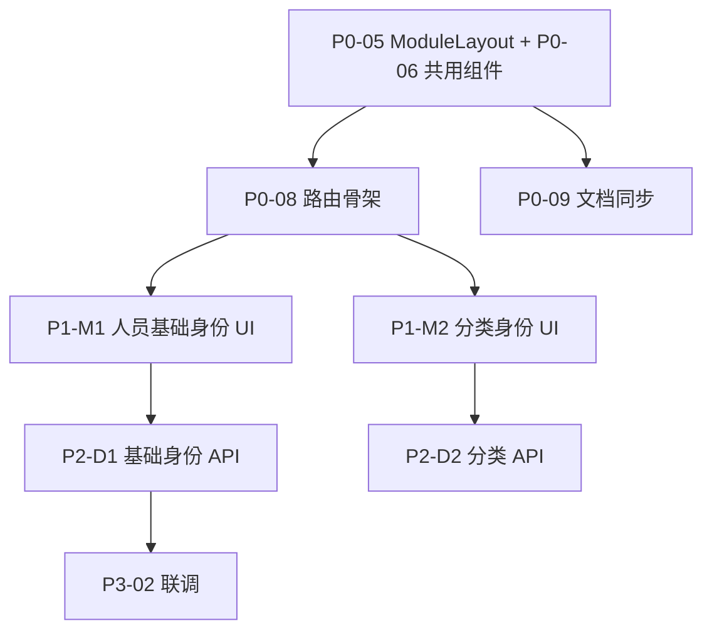

# 04 — 工作清单（Work Backlog）

> 用法：从 Phase 0 起按依赖勾选任务 → 复制到 `docs/requirements/inbox/` 或 `/opsx:propose` 立项。  
> 档位：🟢 轻量 | 🟡 中等 | 🔴 核心（见 `.cursor/rules/00-workflow.mdc`）

**图例**：`[x]` 已完成 · `[~]` 部分完成 · `[ ]` 未开始

---

## Phase 0 — 壳层与文档对齐（建议先做）


| ID    | 状态  | 档位  | 任务                                                                 | 依赖          | 建议 change                   | 验收要点                             |
| ----- | --- | --- | ------------------------------------------------------------------ | ----------- | --------------------------- | -------------------------------- |
| P0-01 | [~] | 🟢  | 设计 Token 对齐 design-spec-light                                      | —           | —                           | tokens/global/element 使用 demo 色板 |
| P0-02 | [~] | 🟢  | 顶栏 AppTopbar + Footer + MainLayout                                 | P0-01       | —                           | 64px 顶栏、1440 内容区、页脚              |
| P0-03 | [~] | 🟢  | 登录页（Demo 无参照，同规范自建）                                                | P0-01       | —                           | Mock 登录闭环                        |
| P0-04 | [~] | 🟡  | 首页 HomeView UI + Mock 联动                                           | P0-02       | —                           | 7 导航卡 + 双数据卡 + 4 权限卡             |
| P0-05 | [ ] | 🟡  | **ModuleLayout**：顶栏下左侧模块 Sidebar 槽位                                | P0-02       | `platform-module-layout`    | 支持「人员管理 5 项」配置化菜单                |
| P0-06 | [ ] | 🟡  | 提取共用布局组件：`AppBreadcrumb` / `PageHead` / `SectionTitle`             | P0-02       | 同上                          | 与 demo 样式一致，Home + 业务页复用         |
| P0-07 | [ ] | 🟡  | 提取共用 UI 组件（第一批）：`FilterBar`、`DataCard`、`StatusBadge`               | P0-06       | `platform-ui-primitives`    | 覆盖 m1/m2 筛选条与卡片样式                |
| P0-08 | [ ] | 🟢  | 顶栏/首页导航 **RouterLink 接线**                                          | P0-04,P0-05 | `platform-routing-skeleton` | 7 功能卡 + 顶栏项可跳转（可先空页面）            |
| P0-09 | [ ] | 🟡  | 同步 OpenSpec + domain：`platform-shell` 改为顶栏+模块布局                    | P0-05       | `platform-shell-v2-sync`    | spec/context-map/UL 与代码一致        |
| P0-10 | [ ] | 🟢  | 迁移 Demo Mock：`sysu-cls.js` / `sysu-org.js` → `frontend/src/mocks/` | —           | `demo-mock-data`            | TS 模块导出，供 Phase 1 页面使用           |


---

## Phase 1 — 前端 Demo parity（Mock 驱动，无后端）

> 目标：12 个 demo 页面「能点能看」，数据来自 mock，不接 API。  
> 每个模块可独立 change，统一依赖 Phase 0。

### 1A 身份管理


| ID     | 状态  | 档位  | 任务                          | Demo 参照            | 路由建议                             | 建议 change                 |
| ------ | --- | --- | --------------------------- | ------------------ | -------------------------------- | ------------------------- |
| P1-M1  | [ ] | 🟡  | 人员基础身份 — 基础数据列表+筛选+详情抽屉     | m1                 | `/identity/basic`                | `ui-basic-identity`       |
| P1-M1b | [ ] | 🟡  | 人员基础身份 — 变更记录视图             | m1 `#view-changes` | `/identity/basic/changes`        | 同上或子任务                    |
| P1-M2  | [ ] | 🔴  | 人员分类身份 — 分类树 + 详情面板         | m2 `#view-tree`    | `/identity/classification`       | `ui-classification`       |
| P1-M2b | [ ] | 🟡  | 人员分类 — 已映射/待映射/变更 三视图       | m2                 | tab 或子路由                         | 同上                        |
| P1-M2c | [ ] | 🟡  | 分类导入导出（Excel/Word/PDF 前端导出） | m2                 | 按钮能力                             | 同上                        |
| P1-M2d | [ ] | 🟡  | 分类管理子站 — 树/映射/花名册/变更        | m2-admin           | `/identity/classification/admin` | `ui-classification-admin` |
| P1-M3  | [ ] | 🟡  | 人员岗位身份 — 只读列表 + 来源映射        | m3                 | `/identity/position`             | `ui-position-identity`    |
| P1-M4  | [ ] | 🔴  | 组织机构 — 树编辑 + 来源映射 + 变更      | m4                 | `/identity/org`                  | `ui-org-structure`        |
| P1-M7  | [ ] | 🟡  | 自定义标签 — 标签组 + 组内人员          | m7                 | `/identity/tags`                 | `ui-custom-tags`          |


### 1B 权限与系统服务


| ID     | 状态  | 档位  | 任务                                      | Demo 参照            | 路由建议                   | 建议 change                |
| ------ | --- | --- | --------------------------------------- | ------------------ | ---------------------- | ------------------------ |
| P1-M5  | [ ] | 🔴  | 身份权限管理 — 8 子视图（矩阵/对账/僵尸/目录/任务/规则/记录/来源） | m5                 | `/identity/permission` | `ui-identity-permission` |
| P1-M6  | [ ] | 🟡  | 数据查询 — 身份主题表/综合主题表/SQL                  | m6                 | `/services/query`      | `ui-data-query`          |
| P1-M6b | [ ] | 🟡  | ETL 任务执行监控                              | etl-monitor        | `/services/etl`        | `ui-etl-monitor`         |
| P1-M6c | [ ] | 🟡  | 源头维护                                    | source-maintenance | `/services/sources`    | `ui-source-maintenance`  |


### 1C 首页增强


| ID    | 状态  | 档位  | 任务                                | 依赖       | 建议 change                   |
| ----- | --- | --- | --------------------------------- | -------- | --------------------------- |
| P1-H1 | [ ] | 🟢  | 首页功能卡跳转至 Phase 1 对应路由             | P1-* 占位页 | `platform-routing-skeleton` |
| P1-H2 | [ ] | 🟡  | 首页统计改读 mock service（与 m1/m5 数据同源） | P0-10    | `ui-home-dashboard-mock`    |


---

## Phase 2 — 领域建模与后端奠基

> 在 Phase 1 视觉稳定后，按限界上下文逐个落地 API。🔴 档走完整 OpenSpec + domain。


| ID    | 状态  | 档位  | 任务                                           | 依赖          | 建议 change                  | 说明                       |
| ----- | --- | --- | -------------------------------------------- | ----------- | -------------------------- | ------------------------ |
| P2-D0 | [ ] | 🔴  | DDD 初版：context-map + UL + domain-model（身份平台） | —           | `identity-platform-domain` | 覆盖 m1~m7、m5 核心术语         |
| P2-D1 | [ ] | 🔴  | 人员基础身份聚合 + 表结构 + CRUD/查询 API                 | P2-D0       | `basic-identity`           | m1 后端                    |
| P2-D2 | [ ] | 🔴  | 人员分类体系 + 映射规则 API                            | P2-D0,P2-D1 | `classification-identity`  | m2/m2-admin              |
| P2-D3 | [ ] | 🔴  | 组织机构树 API                                    | P2-D0       | `org-structure`            | m4；可导入 sysu-org 种子       |
| P2-D4 | [ ] | 🟡  | 岗位身份只读 API                                   | P2-D1,P2-D3 | `position-identity`        | m3                       |
| P2-D5 | [ ] | 🟡  | 自定义标签 API                                    | P2-D1       | `custom-tags`              | m7                       |
| P2-D6 | [ ] | 🔴  | 权限项 / 授权矩阵 / 对账只读 API                        | P2-D0,P2-D1 | `identity-permission`      | m5；业务规则复杂                |
| P2-D7 | [ ] | 🟡  | Dashboard 汇总统计 API                           | P2-D1,P2-D6 | `platform-dashboard`       | 首页                       |
| P2-D8 | [ ] | 🟡  | 数据源 / ETL 任务注册与状态 API                        | P2-D0       | `system-etl-sources`       | etl + source-maintenance |
| P2-D9 | [ ] | 🔴  | 数据查询（主题表/SQL 网关）                             | P2-D1~D3    | `data-query-service`       | m6；安全策略门禁                |
| P2-A1 | [ ] | 🔴  | 真实 identity-access 替换 Mock 登录                | P2-D0       | `identity-access`          | 权限策略、用户岗位                |


---

## Phase 3 — 前后端联调与替换 Mock


| ID    | 状态  | 档位  | 任务                                    | 依赖           |
| ----- | --- | --- | ------------------------------------- | ------------ |
| P3-01 | [ ] | 🟡  | 前端 API 层（axios/fetch + 按 context 分模块） | P2-*         |
| P3-02 | [ ] | 🟡  | m1 联调：列表/详情/变更                        | P2-D1,P1-M1  |
| P3-03 | [ ] | 🔴  | m2/m2-admin 联调                        | P2-D2,P1-M2* |
| P3-04 | [ ] | 🔴  | m4 联调                                 | P2-D3,P1-M4  |
| P3-05 | [ ] | 🔴  | m5 联调                                 | P2-D6,P1-M5  |
| P3-06 | [ ] | 🟡  | 首页 dashboard 联调                       | P2-D7,P1-H2  |
| P3-07 | [ ] | 🟡  | m6/etl/sources 联调                     | P2-D8,P2-D9  |


---

## Phase 4 — 质量与交付（横切）


| ID    | 状态  | 档位  | 任务                                | 说明                 |
| ----- | --- | --- | --------------------------------- | ------------------ |
| P4-01 | [ ] | 🟡  | E2E 冒烟：登录 → 首页 → 各顶栏入口            | Playwright/Cypress |
| P4-02 | [ ] | 🟡  | 关键 Controller 深度链路测试              | 按项目 rule           |
| P4-03 | [ ] | 🟢  | 响应式断点验证（demo 含 600/900/1200/1400） | 与 demo 一致          |
| P4-04 | [ ] | 🟡  | 无障碍：键盘导航、aria（顶栏下拉）               | 壳层优先               |


---

## 推荐立项顺序（最小路径）




**第一批建议创建的任务（3 个 change）：**

1. `**platform-module-layout`**（🟡）— P0-05 ~ P0-08 + P0-09
2. `**ui-basic-identity**`（🟡）— P1-M1 + P1-M1b（Mock）
3. `**demo-mock-data**`（🟢）— P0-10

---

## 任务 → Requirements 模板字段

复制下表一行到 inbox 时，可填：

```yaml
title: <任务标题>
status: inbox
change: <建议 change 名>
tier: 🟢|🟡|🔴
type: 业务|技术|混合
demoRef: docs/原始demo/<file>.html
dependsOn: [P0-05, ...]
acceptance:
  - <可测试 AC 1>
  - <可测试 AC 2>
```

---

## 已完成项（便于归档，勿重复立项）

- [x] 前端工程初始化（Vue3/TS/Element Plus）
- [x] Mock 登录 + 路由守卫
- [x] 顶栏布局 + 首页 Mock UI（对齐 `页面主页.html`）
- [x] design-spec-light tokens
- [x] 清理废弃侧栏脚手架（AppSidebar 等）

---

## 风险与决策点（立项前确认）


| 话题                        | 选项                  | 建议                             |
| ------------------------- | ------------------- | ------------------------------ |
| Phase 1 是否必须像素级还原 demo    | A 结构+交互 / B 像素级     | **A**，共用组件收敛 CSS               |
| m2-admin 独立路由 vs m2 内 Tab | 子路由 `/admin`        | 与 demo 一致用**独立子站**             |
| m5 八视图是否拆多个 change        | 单 change / 按视图拆     | 单 change UI parity，后端再拆        |
| sysu 种子数据                 | 仅前端 mock / 导入 DB    | Phase 1 前端；Phase 2 Flyway seed |
| 真实鉴权时间点                   | Phase 2 末 / 与 m5 同步 | 不早于 P2-D6 权限模型草案               |


