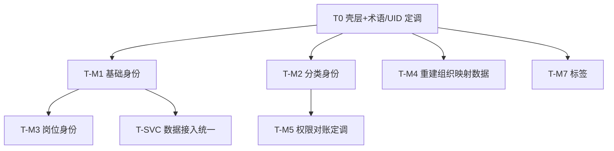

# 05 — Demo 页面级功能任务清单

> 这是 [04-work-backlog.md](./04-work-backlog.md) Phase 1（前端 parity）的**细粒度展开**：把每个 demo 页面拆成可独立验收的功能任务。  
> 配套 [06-open-questions.md](./06-open-questions.md)：`关联疑问` 列引用其编号，**🔴 项需在该功能开工前确认**。  
> 生成：2026-06-19，基于逐页精读。

## 图例

- 状态：`[ ]` 未开始 · `[~]` demo 有雏形待 Vue 化 · `[x]` 已完成
- 档位：🟢 轻量 · 🟡 中等 · 🔴 核心（见 `.cursor/rules/00-workflow.mdc`）
- 关联疑问：见 06 台账；**带 🔴 的必须先确认再写代码**

> ⚠️ **统一前置**：所有 demo 为纯静态 + 内联/localStorage mock，无后端。Phase 1 仅做「能点能看」的前端 parity，数据走 mock service；真实 API 在 04 的 Phase 2/3。

---

## 0. 壳层与公共能力（前置，阻塞所有页面）

| ID | 状态 | 档位 | 任务 | Demo 参照 | 关联疑问 |
| --- | --- | --- | --- | --- | --- |
| T0-01 | [~] | 🟡 | ModuleLayout：顶栏下「左侧栏 + 主区」两栏布局 | 所有 m* 页 | — |
| T0-02 | [ ] | 🟡 | 可配置侧栏：支持「跨模块组 + 模块内 data-view 组」两段式菜单 | m1~m7 侧栏 | Q-M2-01 |
| T0-03 | [ ] | 🟡 | 公共组件：`AppBreadcrumb`/`PageHead`/`SectionTitle`/`FilterBar`/`DataCard`/`StatusBadge`/`Drawer`/`Toast` | 全站 | — |
| T0-04 | [ ] | 🟢 | 子视图路由：每个 view 用独立子路由（替代 demo 的 data-view JS 切换），支持深链 | m2/m5/m6 | QG-06 |
| T0-05 | [ ] | 🟢 | Mock 数据迁移：`sysu-cls.js`/`sysu-org.js` → `frontend/src/mocks/*.ts` | sysu-*.js | — |
| T0-06 | [ ] | 🔴 | **统一术语与 UID 规范**（建模产物，阻塞跨模块关联） | 全站 | QG-01 QG-04 QG-08 QG-09 |

---

## 1. 平台首页（`/`）

> demo：`页面主页.html`（`platform-v2-home.html` 为重复副本，见 QG-02）。当前已 Vue 化，余下为增强。

| ID | 状态 | 档位 | 任务 | 关联疑问 |
| --- | --- | --- | --- | --- |
| T-HOME-01 | [x] | 🟡 | 7 功能导航卡 + 人员总览 + 权限饼图联动 | — |
| T-HOME-02 | [ ] | 🟢 | 功能卡 → Phase 1 路由跳转（替换 `alert/href`） | QG-07 |
| T-HOME-03 | [ ] | 🟢 | 统计数字改读统一 mock service（与 m1/m5 同源） | Q-HOME-01 QG-05 |
| T-HOME-04 | [ ] | 🟢 | 饼图/权限卡 drill-down（可选，demo 无） | — |
| T-HOME-05 | [ ] | 🟢 | 修正「覆盖率↑」硬编码、「未授权」语义文案 | Q-HOME-02 Q-HOME-03 |

---

## 2. 人员基础身份（`/identity/basic`）— demo `m1-basic-identity.html`

| ID | 状态 | 档位 | 任务 | 关联疑问 |
| --- | --- | --- | --- | --- |
| T-M1-01 | [ ] | 🟡 | 基础数据列表 + 搜索 + 数据源筛选 + 真实分页 | Q-M1-06 |
| T-M1-02 | [ ] | 🟢 | 补齐失效筛选（国籍/证件类型）绑定 | Q-M1-07 |
| T-M1-03 | [ ] | 🟡 | 人员详情抽屉（基本信息 + 来源归属 + 个人变更时间轴） | — |
| T-M1-04 | [ ] | 🔴 | **明确详情抽屉是否可编辑**（与「平台不手工修改自然人」定调） | Q-M1-02 |
| T-M1-05 | [ ] | 🔴 | **变更记录统一真相源**（合并全局/个人双轨，定义可追溯字段） | Q-M1-03 Q-M1-04 |
| T-M1-06 | [ ] | 🟡 | 变更记录视图（时间轴 + 可用筛选） | Q-M1-07 |
| T-M1-07 | [ ] | 🟡 | 冲突裁定：若需处理，新增待办队列 + 裁定工作台；否则降级为只读说明 | Q-M1-05 |
| T-M1-08 | [ ] | 🟢 | 导出按钮接入（或明确移除） | — |
| T-M1-09 | [ ] | 🟢 | 侧栏「更新同步人员」「源头维护」入口归位（与 QG-08 统一决策） | Q-M1-01 QG-08 |

---

## 3. 人员分类身份（`/identity/classification` + `/admin`）— demo `m2-classification.html` / `m2-classification-admin.html`

> 🔴 本模块整体依赖 QG-08 之外，最关键是 Q-M2-01/02 的导航与未映射闭环。

| ID | 状态 | 档位 | 任务 | 关联疑问 |
| --- | --- | --- | --- | --- |
| T-M2-01 | [ ] | 🔴 | **理顺主站 4 视图导航**：tree/data/unmapped/changes 全部给侧栏或子路由入口 | Q-M2-01 |
| T-M2-02 | [ ] | 🔴 | **未映射人员闭环**：列表 → 映射处理 → 入库结果（统一一套数据与动作） | Q-M2-02 Q-M2-05 |
| T-M2-03 | [ ] | 🔴 | 分类体系树（展开/搜索/根类型筛选 + 节点详情钻取） | Q-M2-07 |
| T-M2-04 | [ ] | 🟡 | 人员分类基础数据列表（一人多类型 / 未映射混排筛选） | — |
| T-M2-05 | [ ] | 🟡 | 变更记录视图（与 admin 共享单一来源） | Q-M2-04 |
| T-M2-06 | [ ] | 🟡 | 导入导出（Excel/Word/PDF）前端能力（统一存储键） | Q-M2-04 Q-M2-09 |
| T-M2-07 | [ ] | 🔴 | **明确 m2 主站 vs admin 职责边界**（浏览 vs 维护） | Q-M2-06 |
| T-M2-08 | [ ] | 🔴 | admin 分类树维护（增删改 + 持久化 + 层级与真实数据一致） | Q-M2-07 |
| T-M2-09 | [ ] | 🔴 | admin 映射管理：总体映射 + 源头映射，补齐映射编辑/解除映射入口 | Q-M2-03 Q-M2-10 |
| T-M2-10 | [ ] | 🟡 | admin 人员分类清单 + 编辑抽屉 | — |

---

## 4. 人员岗位身份（`/identity/position`）— demo `m3-position.html`

| ID | 状态 | 档位 | 任务 | 关联疑问 |
| --- | --- | --- | --- | --- |
| T-M3-01 | [ ] | 🔴 | **定义「只读主数据」与「映射治理可写」边界**（同模块两种读写语义） | Q-M3-01 |
| T-M3-02 | [ ] | 🟡 | 岗位身份数据列表（一人多岗 rowspan + 筛选 + 真实详情） | Q-M3-06 |
| T-M3-03 | [ ] | 🔴 | 岗位映射向导（源头加载 → 拆分 → 标定 → 入库） | Q-M3-04 |
| T-M3-04 | [ ] | 🔴 | **修正拆分分隔符**：`/` 不应拆单位名，需白名单/转义 | Q-M3-02 |
| T-M3-05 | [ ] | 🟡 | 来源列展示修正（真实 source vs 类型标签） | Q-M3-03 Q-M3-11 |
| T-M3-06 | [ ] | 🟡 | 入库校验：待定/无效是否可入库、savedCount 口径 | Q-M3-04 |
| T-M3-07 | [ ] | 🟢 | 保存映射后主数据刷新 / 文案与「系统配置」依赖说明 | Q-M3-05 Q-M3-09 Q-M3-07 |

---

## 5. 组织机构体系（`/identity/org`）— demo `m4-org.html`

> 🔴 Q-M4-01 是阻断项：demo 的映射/花名册数据与真实组织树基本对不上，本页几乎不可用。

| ID | 状态 | 档位 | 任务 | 关联疑问 |
| --- | --- | --- | --- | --- |
| T-M4-01 | [ ] | 🔴 | **重建映射/花名册数据，按 `SYSU_ORG.code` 对齐**（或回退小树 demo） | Q-M4-01 Q-M4-04 |
| T-M4-02 | [ ] | 🟡 | 组织机构树（展开/搜索/层级筛选，覆盖 L1–L5） | Q-M4-06 |
| T-M4-03 | [ ] | 🔴 | 节点详情 + 编辑/新增子级（持久化，去掉 alert 占位） | Q-M4-02 |
| T-M4-04 | [ ] | 🟡 | 来源映射视图 + 编辑映射闭环 | Q-M4-03 |
| T-M4-05 | [ ] | 🟡 | 变更记录（编码体系与组织树统一） | Q-M4-05 |

---

## 6. 身份权限管理（`/identity/permission`）— demo `m5-identity-permission.html`

> 🔴 本模块定位需先定调（Q-M5-01）：它是「对账治理」而非「授权操作」。

| ID | 状态 | 档位 | 任务 | 关联疑问 |
| --- | --- | --- | --- | --- |
| T-M5-01 | [ ] | 🔴 | **模块定位与命名定调**：授权矩阵=对账基线（只读/可维护？），与「不参与授权」一致 | Q-M5-01 |
| T-M5-02 | [ ] | 🔴 | 授权矩阵（分类×权限项）+ 行展开对账明细 | Q-M5-03 |
| T-M5-03 | [ ] | 🔴 | **对账处置闭环**：对账异常/僵尸账号 → 推送源头 → 推送状态/回执 | Q-M5-02 |
| T-M5-04 | [ ] | 🟡 | 公共权限项维护（列表 + 启停 + 新增） | Q-M5-05 |
| T-M5-05 | [ ] | 🟡 | 检查任务（卡片 + 新建向导 + 立即执行） | Q-M5-04 |
| T-M5-06 | [ ] | 🟡 | 检查规则库（列表 + 启停 + 新增） | Q-M5-04 Q-M5-05 |
| T-M5-07 | [ ] | 🟡 | 任务执行情况（统计卡 + 日志 + 重试） | Q-M5-04 |
| T-M5-08 | [ ] | 🟢 | 数据源对接视图（权限系统源，术语与采集源区分） | QG-01 |
| T-M5-09 | [ ] | 🟢 | 修正 badge 与 mock 数量一致、组织筛选生效 | Q-M5-05 Q-M5-06 |

---

## 7. 数据查询（`/services/query`）— demo `m6-data-query.html`

| ID | 状态 | 档位 | 任务 | 关联疑问 |
| --- | --- | --- | --- | --- |
| T-M6-01 | [ ] | 🟡 | 人员身份数据查询（4 表卡片 + 筛选 + 列表 + 真实分页/导出） | Q-M6-05 |
| T-M6-02 | [ ] | 🟡 | 人员主题数据查询（主从 + 字段配置，统一主题数据源） | Q-M6-04 |
| T-M6-03 | [ ] | 🔴 | SQL 查询：**权限/安全边界设计**（ACL/行级/审计/脱敏/SELECT 白名单） | Q-M6-01 |
| T-M6-04 | [ ] | 🟡 | SQL 引擎与表清单对齐（修复 `TABLE_CONFIG.org` 异常、列字段一致） | Q-M6-02 |
| T-M6-05 | [ ] | 🔴 | **界定权限明细的权威读模型归属**（m5 对账 vs m6 查询） | Q-M6-03 |

---

## 8. 系统服务 — 数据接入（ETL + 源头维护）

> demo：`etl-monitor.html` + `source-maintenance.html`。🔴 QG-08：需统一「数据接入」上下文。

| ID | 状态 | 档位 | 任务 | 关联疑问 |
| --- | --- | --- | --- | --- |
| T-SVC-01 | [ ] | 🔴 | **统一数据接入设计**：源头注册 → ETL 采集 → 入库，串起 source-maintenance 与 etl | QG-08 Q-ETL-02 Q-SRC-02 |
| T-SVC-02 | [ ] | 🟡 | ETL 任务监控（任务列表 + 顺序执行 + 依赖检查 + 状态） | Q-ETL-01 Q-ETL-03 |
| T-SVC-03 | [ ] | 🟡 | 源头维护（大类配置 + 字段映射可编辑 + 持久化） | Q-SRC-02 Q-SRC-03 |
| T-SVC-04 | [ ] | 🟢 | 重写 source-maintenance（demo HTML 结构损坏，需从零搭） | Q-SRC-01 |
| T-SVC-05 | [ ] | 🟢 | ETL 与 m5「检查任务」概念区分说明（采集 vs 对账） | Q-ETL-04 |

---

## 9. 自定义标签身份（`/identity/tags`）— demo `m7-custom-tags.html`

| ID | 状态 | 档位 | 任务 | 关联疑问 |
| --- | --- | --- | --- | --- |
| T-M7-01 | [ ] | 🟡 | 群组管理（卡片 + 新建群组/标签 + 删除群组 UI） | Q-M7-04 |
| T-M7-02 | [ ] | 🟡 | 标签 + 组内人员管理（添加/移除人员） | — |
| T-M7-03 | [ ] | 🟢 | 批量添加改为「先预览再确认」两步 | Q-M7-03 |
| T-M7-04 | [ ] | 🟡 | 人员标签查询（筛选 + 分页） | — |
| T-M7-05 | [ ] | 🟢 | 初始统计回填（tag.personCount）、UID 体系对齐平台 | Q-M7-01 QG-04 |
| T-M7-06 | [ ] | 🟡 | 与岗位身份数据源打通（校验是否有岗位身份） | Q-M7-02 |

---

## 推荐推进顺序

**第一批建议立项（前端 parity，依赖最小）：**

1. `platform-module-layout`（T0-01~05）— 壳层 + 公共组件 + mock 迁移
2. `ui-basic-identity`（T-M1，先确认 Q-M1-02/03）
3. `ui-classification`（T-M2，先确认 Q-M2-01/02）

**建模优先（阻塞多个模块，建议并行启动）：**

- `identity-platform-domain`（对应 T0-06）：解决 QG-01/04/08 + 各模块 🔴 边界，产出统一术语/UID/数据接入上下文。

---

## 与 04 backlog 的关系

- 04 = Phase 级路线图（P0~P4，含后端/联调/质量）。
- 05（本文件）= Phase 1 前端 parity 的页面级分解，**每个 T-* 可直接复制进 `docs/requirements/inbox/` 立项**。
- 06 = 阻塞 05 的产品/逻辑确认台账。
